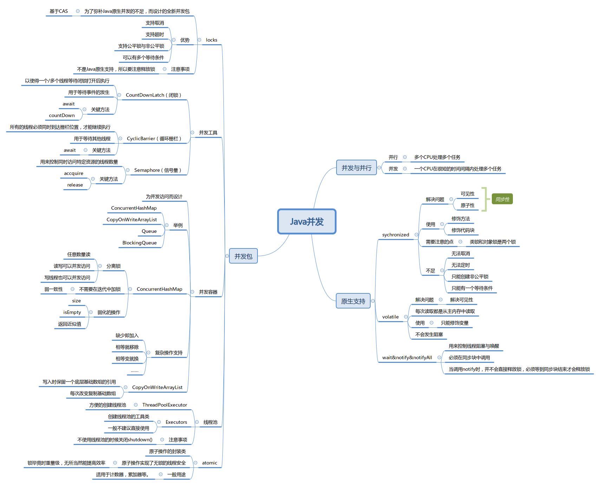

# 第四周 学习笔记

## 作业
Week04 作业题目（周三）：

1. 2.（必做）思考有多少种方式，在 main 函数启动一个新线程，运行一个方法，拿到这个方法的返回值后，退出主线程?

[多种方式返回-代码](https://github.com/laozhaishaozuo/JAVA-01/tree/main/Week_04/code)

1. 使用 Future
2. 使用 volatile
3. 使用 CountDownLatch
4. 使用 CyclicBarrier
5. 使用 Semaphore
6. 适用 FutureTask
7. 使用 ReentrantLock
8. 使用 synchronized
9. 使用 CompletableFuture
10. 使用 Thread.join
11. 使用 LockSupport

Week04 作业题目（周日）：

4. （必做）把多线程和并发相关知识梳理一遍，画一个脑图，截图上传到 GitHub 上。

