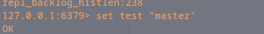
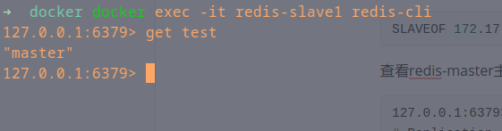
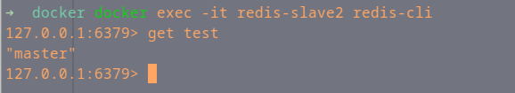

# Redis配置

## 通用步骤

### 安装redis

搜索redis镜像

```shell
docker search redis
```

拉取镜像

```shell
docker pull  redis
```

下载完成后，我们就可以在本地镜像列表里查到REPOSITORY为redis

```shell
docker images redis
REPOSITORY   TAG       IMAGE ID       CREATED       SIZE
redis        latest    cc69ae189a1a   6 weeks ago   105MB
```

## Redis主从

### 运行redis镜像

   ```shell
   docker run -p 6379:6379 --name redis-master -v /opt/data/docker/redis/6379.conf:/etc/redis/redis.conf -v /opt/data/docker/redis/6379/data:/data -d redis redis-server /etc/redis/redis.conf --appendonly yes
   
   
   docker run -p 6380:6379 --name redis-slave1 -v /opt/data/docker/redis/6380.conf:/etc/redis/redis.conf -v /opt/data/docker/redis/6380/data:/data -d redis redis-server /etc/redis/redis.conf --appendonly yes
   
   
   docker run -p 6381:6379 --name redis-slave2 -v /opt/data/docker/redis/6381.conf:/etc/redis/redis.conf -v /opt/data/docker/redis/6381/data:/data -d redis redis-server /etc/redis/redis.conf --appendonly yes
   ```

以上名命令分别启动了3个redis，端口分别是6379、6380、6381
命令说明：

1. -p 6379:6379  将容器的6379端口映射到主机的6379端口
2. --name redis-master 容器名称为redis-master，后续可以通过容器名称进行操作
3. -v /opt/data/docker/redis/6379.conf:/etc/redis/redis.conf  将主机中/opt/data/docker/redis/6379.conf 挂载到容器的 /etc/redis/redis.conf
4. -v /opt/data/docker/redis/6379/data:/data  将主机中/opt/data/docker/redis/6379/data挂载到容器的/data
5. -d 后台模式运行
6. redis-server --appendonly yes  在容器执行redis-server启动命令，并打开redis持久化配置

### 查看redis容器的内网地址
查看容器内网的ip地址等信息
```shell
#docker inspect redis-master #可以使用容器id或容器名称
docker inspect redis-master | grep  "IPAddress"
            "SecondaryIPAddresses": null,
            "IPAddress": "172.17.0.4",
                    "IPAddress": "172.17.0.4",

```
> ps:因为第一次启动redis-master报错，所以ip地址排序在后


经查询三个redis的地址分别是：
```shell
redis-master 172.17.0.4
redis-slave1 172.17.0.2
redis-slave2 172.17.0.3
```
### 修改从服务器配置

进入docker容器内部

```shell
docker exec -it redis-master redis-cli #进入docker容器内部
```

查看当前redis角色（主master还是从slave）（命令：info replication）

```
info replication
```

可以看到当前3台redis都是master角色，使用redis-cli命令修改redis-slave1、redis-slave2的主机为172.17.0.4:6379

```shell
SLAVEOF 172.17.0.4 6379
```

查看redis-master主从信息

```
127.0.0.1:6379> info replication
# Replication
role:master
connected_slaves:2
slave0:ip=172.17.0.2,port=6379,state=online,offset=422,lag=0
slave1:ip=172.17.0.3,port=6379,state=online,offset=422,lag=0
master_failover_state:no-failover
master_replid:b7424ad261f29667e158329786f74545a936d6dc
master_replid2:0000000000000000000000000000000000000000
master_repl_offset:422
second_repl_offset:-1
repl_backlog_active:1
repl_backlog_size:1048576
repl_backlog_first_byte_offset:1
repl_backlog_histlen:422

```


### 测试主从

在主服务器中执行命令 `set test "master"`



分别在从服务器中查看`get test`



